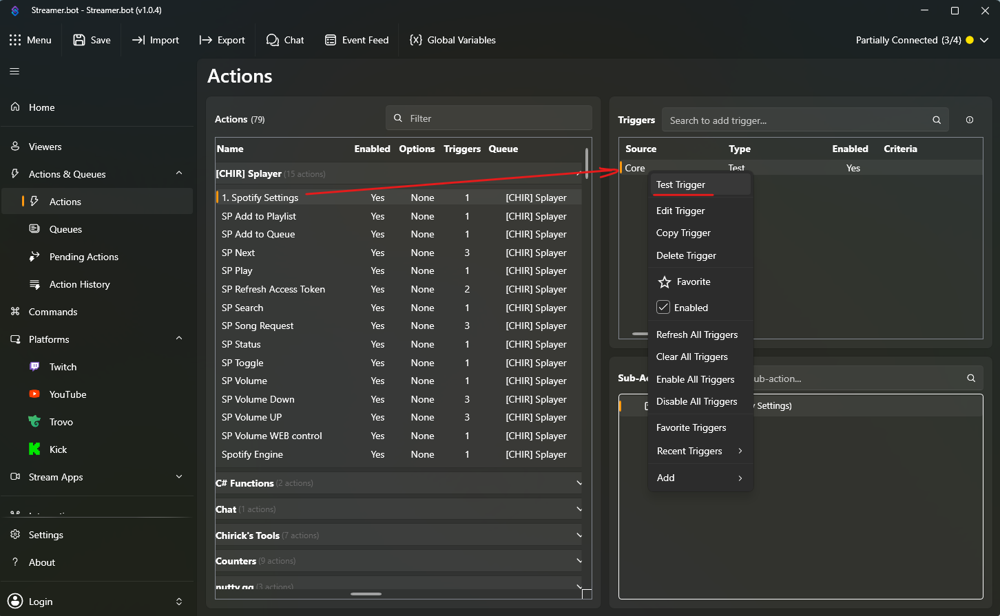
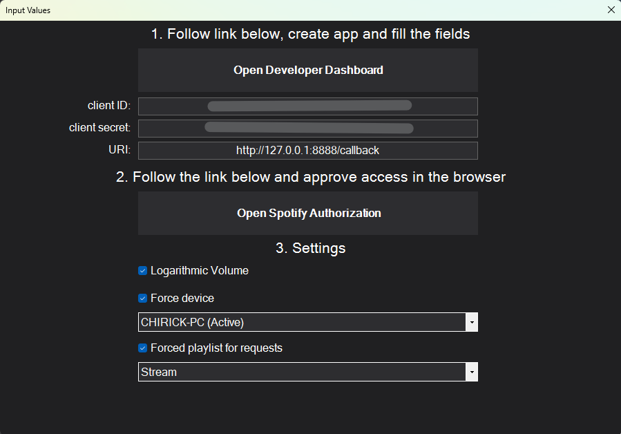
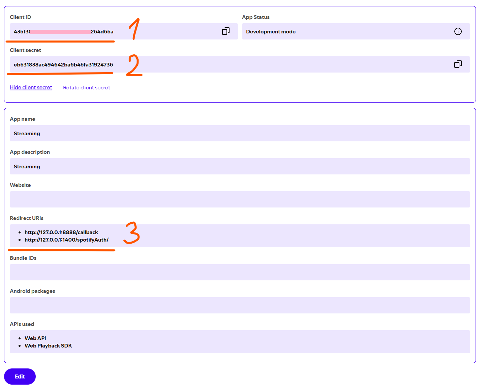

# Splayer

Spotify helper scripts for Streamer.bot. It provides Spotify authorization, playback control, device selection, playlist selection, and simple overlay/widget support.

## Installation

1. Import Splayer string to your Streamer.bot
2. Done!

## Quick Setup

1. Run the 1. Spotify Settings action to open the settings form.
2. In that form: 
3. open the Spotify Developer Dashboard and create an app.
4. Copy your app `Client ID`, `Client Secret`, and `Redirect URI` into the form.
5. for the Redirect URI, use `http://127.0.0.1:8080/callback` or any other URI you want, but it must match the one in your Spotify app settings. 
6. click the Spotify authorization button and confirm access.
7. check checkboxes for the options you want to use.
8. Close the form and you've done!

## Video guide:

## Usage

- Use the control actions to play/pause, skip, and change volume.
- Add requested songs to a playlist, queue or both using the Request Song action.
- If you don't want adding songs to a playlist, you should disable sub-action (Add to Playlist) in the Request Song action.
- Use the HTML files in OBS to display "Now Playing" song or control playback.

## Files

- `Splayer.sb` - Streamer.bot string with all actions and settings.
- `SplayerControl.html` - web control panel. (it is an example widget for OBS, you can use it as a web dock or modify it to your needs)
- `SplayerWidget.html` - on-stream widget. (uses 3rd party Tuna plugin for OBS). Place your `SplayerWidget.html` next to your `SpotArtist.txt` and `SpotTrack.txt` files that you use for your OBS Tuna plugin.

## Notes

- You should to enable WebSocket server in Streamer.bot settings to use SplayerControl. It configured to 127.0.0.1:8080 (default).
- The first authorization may be needed before playlists and devices can load.
